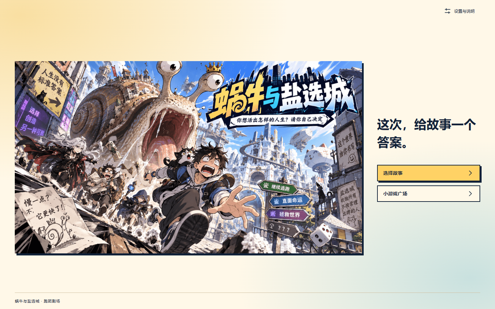
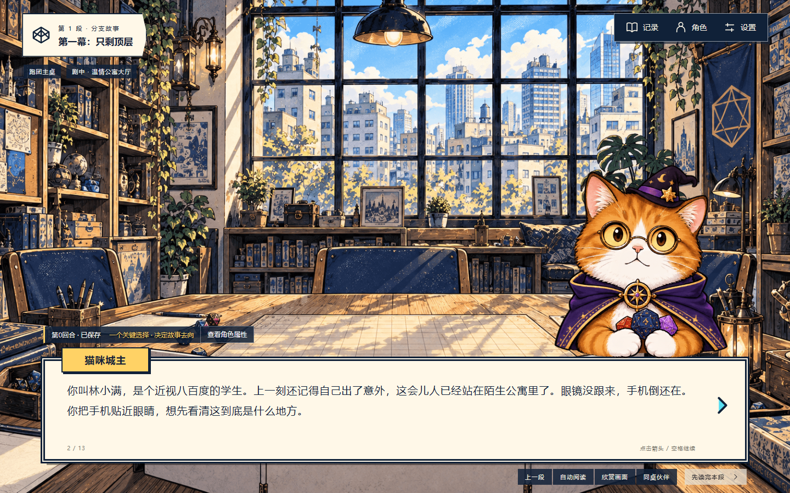
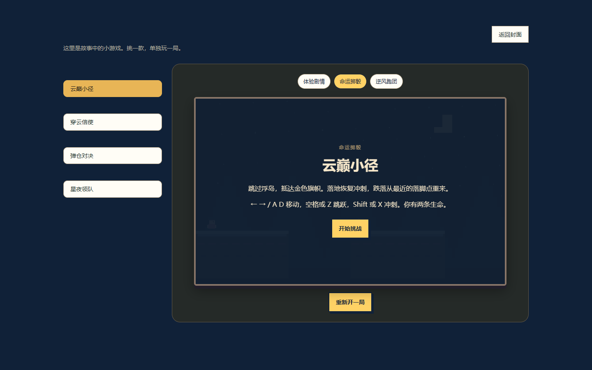

# 蜗牛与盐选城 · 跑团剧场

以知乎故事为参考的文字冒险网页游戏。猫咪城主带你读故事、作选择、掷骰子，走向不同结局。

包含20篇精选剧本、私人／社区书架、结局收藏、知乎登录，以及四款像素小游戏。登录用户可以组合标签与想法生成故事，每天6次，私人书架3个栏位；访客可以直接游玩。

## 运行截图





## 技术方案

- **Next.js + React + TypeScript + Node.js**：同一项目提供页面、接口与规则服务；SQLite 保存身份、进度、书架和生成任务。
- **完整分支剧本**：先生成整稿，经过结构检查、规则回放和叙事审校后入库；游玩时执行确定规则，不逐句请求模型。
- **DeepSeek `deepseek-flash`**：服务端调用、非思考模式、JSON 输出；支持 Mock，默认不会产生模型费用。
- **知乎能力**：黑客松故事目录／详情提供参考，OAuth 提供账号身份。活动内容接口不保证长期开放。
- **阅读与小游戏**：图片预加载后在本页复用；小游戏使用 Canvas，奖励由服务端回放校验；关键结算原子保存且支持幂等重试。

## 本地运行

需要 **Node.js 24.14.x—24.x**，项目锁定 npm 11.9.0。安装、构建和普通测试不会调用付费服务。默认无需密钥、知乎账号、Docker 或 Python 即可游玩精选故事。

Windows PowerShell：

```powershell
npm.cmd ci
# 首次创建配置；已有 .env.local 时不要覆盖
Copy-Item .env.example .env.local
npm.cmd run build
npm.cmd start
```

访问 <http://localhost:3000>。开发模式使用 `npm.cmd run dev`。

Linux/macOS 使用对应的 `npm` 命令，并以 `cp .env.example .env.local` 创建配置；当前开发与浏览器验证环境为 Windows。

## 启用在线生成和知乎登录

在服务端 `.env.local` 中填写凭证，按照 [部署说明](docs/DEPLOYMENT.md) 配置 HTTPS 站点地址、知乎回调、模型开关和预算。**不要提交 `.env.local`，不要将服务端密钥加上 `NEXT_PUBLIC_` 前缀。**

访客不能生成故事；需要先完成知乎 OAuth 配置并登录。完整环境变量示例见 [.env.example](.env.example)。

## 验证

```powershell
npm.cmd test
npm.cmd run typecheck
npm.cmd run build
npm.cmd run test:e2e
```

浏览器测试使用本机 Chrome、3100端口和隔离数据库，关闭真实模型与知乎调用。首次运行前需要安装 Chrome；它不是服务端运行依赖。

## 文件结构

```text
src/app/               页面和服务端接口
src/components/game/   阅读、书架、角色和小游戏界面
src/engine/            判定与分支规则
src/server/            存档、身份、故事来源和生成链路
src/content/           剧本、来源元数据与兼容夹具
public/assets/         当前使用的压缩美术
tests/                 规则、接口逻辑与浏览器回归
data/                  运行时数据，自动创建，不提交
```

当前书架只展示新版精选内容；部分历史规则与故事数据保留用于回归兼容，不作为可新建故事入口。

## 许可与来源

代码采用 [MIT](LICENSE)。**故事正文、改编内容、品牌美术、截图中的内容与第三方资源不自动适用 MIT。** 使用前请阅读 [内容与资源说明](NOTICE.md)；知乎参考作品见 [来源清单](docs/ATTRIBUTIONS.md)。
