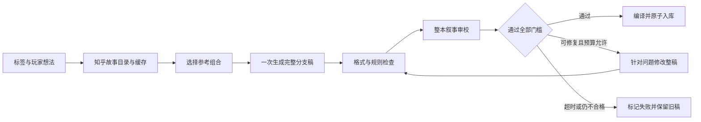

# 《蜗牛与盐选城》产品说明计划书

**项目定位：让知乎故事成为可以亲自作出选择的文字冒险。**

《蜗牛与盐选城》是一款以知乎故事为内容参考、以模拟线下跑团为表现形式的网页游戏。玩家进入故事后，通过角色对话理解处境，在关键节点作出选择，以属性和骰子共同决定行动结果，最终走向不同结局。猫咪城主承担画外音与叙事引导，固定演员可以在不同故事中扮演不同人物。

项目面向喜欢小说、脑洞故事、悬疑推理和角色扮演的读者，也面向希望尝试互动叙事、却没有编程与美术能力的创作者。当前版本提供20篇精选剧本、标签组合生成、知乎账号登录、私人书架、游戏内社区书架、结局收藏与四款剧情小游戏。

我们的核心判断是：**把故事变成游戏，关键不只是让模型多写几段文字，而是让读者理解处境、相信行动的后果，并愿意讨论自己的选择。** 因此，作品以完整的分支剧本承载叙事，以确定性的规则引擎维护结果；模型负责创作，程序负责执行。

## 一、创作思路：从“看别人经历”到“在故事里作答”

知乎故事有鲜明的人物处境、冲突和反转。读者看完一个情节，常常会继续追问：“如果是我，会怎么做？”“这个人还有别的选择吗？”这些问题恰好可以成为互动叙事的入口。

本项目把这种阅读中的思考变成可以实际操作的体验：

1. **先读懂，再决定。** 开篇由城主交代身份、地点、人物关系和眼前目标；人物通过自然对话传递信息。玩家读完当前段落后，才进入行动选择。
2. **选择产生可回顾的后果。** 每个节点提供2—3个符合情境的行动，行动的属性要求、风险和后续路线由剧本定义。判定后先呈现结果，再衔接对应的后续剧情。
3. **结局带来新的阅读视角。** 玩家可以返回书架查看已达成结局，并重玩不同路线。好结局、坏结局与真结局共同呈现人物和冲突的不同侧面。

例如，同样面对一份可疑证词，玩家可能选择检查细节，也可能先说服证人留下。两项行动可以使用不同属性，也可以因为故事需要使用同一属性；它们的要求和后果不必相同。我们希望玩家思考的是“在这个处境下，我相信哪一种办法”，而不是机械地寻找每一幕里最擅长的属性按钮。

### 为什么采用跑团剧场

跑团形式允许同一组演员进入不同题材，减少每换一篇故事就重新制作整套美术的成本。猫咪城主是稳定的叙事入口，其他演员通过姓名、对白和表情承担剧中身份。画面一次突出当前说话者，让注意力回到阅读与选择。

剧本文风采取简单、清晰、口语化的轻小说表达：城主以第二人称“你”描写主角的经历；其他人物只说实际说出口的话。动作、环境、心理提示和场景过渡均归城主发言，不把说明性文字塞进角色嘴里，也不要求玩家从大量碎句中猜背景。

## 二、知乎社区的场景价值

### 1. 为故事提供另一种被发现和理解的方式

读者可以从惊悚、悬疑、脑洞、科幻、言情等标签进入书架。每篇改编故事保留参考作品的标题、作者和来源，使“读到一段有意思的互动故事”能够继续导向“了解这篇故事原本来自哪里”。

这里的价值不是用改编稿替代原文，而是为原作建立新的体验入口：人物处境、叙事设定和冲突可以激发兴趣，互动结局则提供再次阅读、比较与讨论的理由。是否实际提高原作访问和阅读转化，仍需上线后验证，项目不预设未经测量的增长结果。

### 2. 让讨论围绕具体选择展开

多结局故事能够形成具体的交流对象：玩家在哪个节点作了什么选择、为什么相信某个人、是否愿意承担某种风险。相比只讨论“这个故事好不好看”，结局与行动路径提供了更清楚的讨论依据。

当前版本已经具备结局收藏和末幕回顾，能够支撑玩家分享体验；评论、结局海报以及向知乎发布体验帖属于后续方向，**尚未接入知乎发帖或评论接口**。项目不会把游戏内社区书架描述为已经与知乎内容发布系统打通。

### 3. 降低互动故事创作的起点

登录用户选择2—5个标签，再补充不超过500字的想法，就可以请求编写一篇自己的分支故事。用户可以描述希望出现的人物、气氛或冲突，不需要编写提示词模板、分支代码或角色状态机。

生成稿先进入私人书架，创作者可以游玩、查看结果，再决定是否分享到游戏内社区。这使创作更接近“提出想法—体验成稿—选择是否分享”的过程，而不是一次生成后立即公开。当前分享入口不以完成全部结局为前提；通关后的全文解锁帮助玩家进一步理解剧本结构。

### 4. 在内容发现与身份连续性上使用知乎能力

知乎在本项目中承担两项明确职责：

| 能力                        | 产品中的用途                                     | 当前状态                     |
| --------------------------- | ------------------------------------------------ | ---------------------------- |
| 黑客松知乎故事目录与详情    | 提供故事参考、题材标签及来源信息                 | 已接入，支持缓存             |
| 黑客松知乎 OAuth 与基础信息 | 识别用户、恢复私人书架与进度、按账号计算生成机会 | 已接入，开发者已完成真实登录 |

当前没有读取用户的关注列表、收藏、个人创作或历史行为。个性化来自玩家主动选择的标签与描述，而不是后台推断其私人兴趣。

## 三、核心用户体验

### 阅读与游玩

访客无需登录即可体验精选故事、社区故事和小游戏广场。选定故事后，玩家选择男女主角形象、属性分配与难度。属性固定为体魄、身手、头脑、气场，提供均衡及四种专长方案，也可以在总额约束内调整。

进入故事后，玩家通过点击或空格推进对话，通过记录功能查看此前发言。当前角色的姓名和表情与对白一起呈现，主角名称标注“（你）”。当前段落读完后开放行动，经过预览确认、投骰动画和结果对话，进入下一条分支。

每篇剧本有3—5幕、4—6个结局：恰好1个真结局，好结局和坏结局各至少1个。部分路线可提前结束。不同故事按题材和叙事需要决定长度，不用固定等待或重复操作凑时长。

### 生成与私人书架

知乎登录用户每天有6次生成机会，北京时间零点刷新；访客不能生成或重新生成。每个用户最多保留3篇私人剧本，满栏后可以删除一篇，也可以对已有剧本提出新想法并重新生成。

重新生成同样消耗机会。新稿通过检查后才替换原稿，失败保留原稿；已受理的失败任务计入当日次数，重复提交同一个请求不会重复扣次。任务在服务端执行，离开生成页面后仍可继续，用户返回后可以查看状态。

### 社区与结局收藏

每个用户拥有1个游戏内社区展示栏位，下架后可以更换作品。社区发布的是独立快照，修改或删除私人稿不会悄悄改变已经分享的版本，其他玩家也不能替作者重新生成社区作品。

精选剧本在达成全部结局后解锁全文；私人剧本和社区剧本在达成一个结局后解锁全文。结局收藏显示已达成的类别与编号，并提供最后一幕和结局回顾，未解锁结局不提前泄露剧情。

### 剧情中的小游戏

四款像素小游戏分别对应四项属性：平台跳跃、拍翅飞行、随机弹仓对决和街区伙伴集结。剧情先自然描述人物准备做什么，随后进入挑战；小游戏的结果不能决定是否获得主线必需线索。

挑战成功给予小幅属性奖励，失败没有属性惩罚，地图或对局包含随机要素，难度继承开局设置。小游戏提供阅读节奏变化，同时把数值奖励限制在小范围内，避免盖过叙事选择。

## 四、剧本技术方案：先生成完整作品，再执行分支

### 1. 精选与自生成共用一套剧本技术契约

两类剧本采用相同的结构化剧本格式、叙事约束、规则编译和可玩性校验方案。输入是故事参考与创作要求，输出是能够直接运行的完整分支剧本，包含人物、逐段发言、表情、行动、判定档位、分支衔接、小游戏安排和结局。

**精选内容在这套技术方案之上增加 Agent 筛选与编辑环节。** Agent 对候选稿进行通读、路线检查和口语化修订，筛除背景交代不足、人物行为矛盾、衔接生硬或不适合互动化的方案，再将通过审阅的成稿编入精选书架。当前20篇精选稿是离线制作、筛选与修订后的固化版本。

自生成剧本则由在线模型执行编剧与审校任务，在同一套约束和校验下自动入库。两者采用不同的筛选方式与质量门槛，并通过共同的剧本格式、编译与执行机制，为玩家提供一致的操作、结局和存档体验。

### 2. 标签与素材组合

书架筛选采用标签交集：同时选中多个标签时，只展示包含全部所选标签的作品。

生成入口采用另一种明确的逻辑：用户选择K个标签，K为2—5；程序从故事目录挑选与标签相关的参考，优先使组合覆盖所有所选标签，最多使用K篇。这样无需某一篇原作同时具备所有标签，也能支持跨题材创作。素材不足或标签无效时直接提示，不编造不存在的知乎故事。

参考材料帮助模型理解设定、题材和冲突，不要求照搬原故事。优先级是新剧本自身清晰、连贯、可执行，并保留真实来源信息。

### 3. 整本生成与有限修订

生成流程不是在玩家每次点击后临时续写，而是：

初稿一次覆盖全部主线、分支和结局，降低逐幕续写带来的设定漂移。审校围绕整稿检查人物动机、信息出现的顺序、选择后果与后续场景是否一致，并要求修改后重新通过规则检查。修订次数、总请求数和总时限均有边界，不通过无限重试掩盖失败。

提示词特别约束第二人称城主叙述、自然口语、完整背景、对话信息量与非对白归属。程序还会检查角色标识、表情标签、节点引用、活动插入位置及结局数量等结构性条件。

### 4. 程序能够证明什么，不能证明什么

JSON Schema与本地校验可以发现格式、字段和引用错误；规则回放可以检查路径是否能到达阶段与结局；模型审校可以辅助发现矛盾、晦涩表达和不合理衔接。三者结合能够提高成稿的可用性。

但文学表达和人物可信度不能由自动检查完全证明。系统因此采用“合格才入库、失败有反馈、精选增加筛选”的机制，而不承诺任何题材组合都能一次生成高质量作品。

## 五、系统实现与工程取舍

### 整体架构

项目使用 Next.js、TypeScript、React 与 Node.js 构建单体应用，页面、接口与规则服务处于同一项目中；SQLite 保存身份、进度、书架、生成任务与额度记录。像素小游戏在浏览器运行，服务端根据操作记录回放并核定奖励。

| 层次       | 主要职责                                             |
| ---------- | ---------------------------------------------------- |
| 阅读界面   | 对话推进、单角色立绘、记录、选择确认、骰子动画与书架 |
| 游戏规则   | 属性判定、剧情路由、结局条件、小游戏奖励与状态版本   |
| 内容生产   | 素材选择、完整剧本生成、审校修订、格式与可玩性检查   |
| 持久化服务 | 身份会话、原子存档、私人隔离、社区快照与生成额度     |
| 外部能力   | 知乎活动故事接口、知乎登录、DeepSeek 文本模型        |

当前部署适合常驻 Node 单实例与持久磁盘。公开演示采用本地服务配合 HTTPS 隧道；这验证了访问方式，不等同于已完成高并发和长期可用性验证。扩大用户规模时，应优先完善稳定托管、数据库备份与生成队列，再评估共享数据库和多实例部署。

### 模型与规则分工

文本模型使用 DeepSeek `deepseek-flash`，通过服务端 Chat Completions 调用，明确关闭思考模式并使用 JSON 输出。模型凭证不下发到浏览器。

游玩过程中执行的是已经确定的剧本与规则。行动结果、属性变化和下一幕由程序判定，模型不能自行修改游戏状态。当前正式版本不开放关键行动的任意自由输入，以避免玩家提出预写路线之外的目标后，出现“判定成功却进入无关剧情”的体验。

模型主要消耗集中在主动生成与重新生成阶段。浏览精选稿、阅读已生成稿、常规行动和小游戏不需要逐段调用模型，有利于控制运行成本与延迟。

### 存档与一致性

关键结算使用数据库事务、状态版本和幂等请求标识。用户双击、网络重试或重复提交同一行动，不能重复扣资源或推进故事。预览与确认之间如果状态变化，会拒绝过期操作。

知乎登录将用户与稳定身份关联，使跨浏览器恢复、私人书架和每日额度有共同依据。访客仍可游玩，但不能通过清理 Cookie 反复获取生成机会。OAuth `state` 与浏览器会话绑定，短时有效且单次消费；只获取身份所需的基础信息，不保存模型或知乎凭证到前端。

### 图片与阅读连续性

游戏采用有限的固定演员、表情图集和场景，共用素材可以服务不同剧本。当前实际使用12张图片，压缩后约9MB。进入时显示真实加载进度；下载并解码完成后，画面直接使用本页预加载的数据，减少穿透网络对角色切换的影响。文件内容版本标识使图片更新后能够刷新缓存。

这项优化减少的是网络等待，不能保证所有设备都没有解码、内存或渲染开销。图片失败提供重试与先进入选项，不让玩家永久停在加载画面。

## 六、内容来源、分享与开放边界

作品保留知乎参考作品的作者与来源，不把原文表述为项目原创。生成稿明确属于基于参考材料创作的互动故事；游戏内社区分享不等于向知乎自动投稿，也不意味着作者原作被重新授权。

开源采用代码与内容分开说明的方式：项目代码使用 MIT 许可证；知乎原文、改编故事、品牌美术及第三方资源不因此自动获得 MIT 授权。原文缓存、账号数据、密钥、日志和开发过程中的私人资料不上传公开仓库。

当前共享机制限制每个账号1个社区栏位，生成限制为每天6次，能够约束内容产生速度，但不能替代完整的内容治理。规模化开放前，仍需补充举报、审核、下架申诉和侵权处理流程。计划书不将这些规划能力列为当前已经上线的功能。

## 七、当前完成度与验证依据

当前已实现20篇精选剧本、三类书架、知乎登录、标签与描述生成、结局解锁、四属性规则、四款像素小游戏、原子存档和图片预加载。开发者已实际完成知乎登录；生成链路此前完成过真实模型测试，本次开源整理与常规构建测试不调用付费模型。

现有自动化检查覆盖精选结局可达性、规则回放、存档恢复、重复提交、生成额度、失败保留原稿、身份隔离与 OAuth 请求校验。发布整理阶段完整离线回归188项通过，最近一轮桌面／手机尺寸浏览器回归20项通过，其中包括：预加载后阻断图片网络，仍能进入故事并切换说话角色。

这些证据支持当前功能的实现状态，但不代表所有故事都经过完整人工通关，也不代表已测得公网并发容量、留存率或用户满意度。项目不以固定“30分钟”作为内容质量指标。

## 八、发布后的验证计划

首轮以小范围读者试玩为主，验证三个问题：读者是否理解故事，是否愿意尝试另一条结局，以及是否愿意发布自己生成的作品。

| 需要验证的问题     | 观察方式                             | 根据结果采取的行动               |
| ------------------ | ------------------------------------ | -------------------------------- |
| 背景与选择是否清楚 | 收集读者无法理解的段落和节点反馈     | 优先修订提示词与精选成稿         |
| 分支是否值得重玩   | 观察单篇不同结局的达成情况           | 调整路线差异与结局信息结构       |
| 自动生成是否稳定   | 记录受理、通过、失败类别、耗时及用量 | 优化校验与修订预算，保留失败退出 |
| 社区内容是否可读   | 比较私人稿分享、他人游玩和反馈       | 增加审核与展示排序机制           |
| 是否带动原作兴趣   | 在明确告知的前提下统计来源入口使用   | 优化来源呈现与原作发现入口       |

上述是待验证的产品假设，不是当前已经取得的数据。后续优先改善阅读理解与可靠性，再扩展内容数量、讨论功能和分享方式。

## 九、项目的核心贡献

《蜗牛与盐选城》尝试把知乎故事中的“处境与选择”转化为一种新的阅读参与方式：读者在故事中作答，通过结局理解不同选择的代价；创作者从标签和想法出发，获得可以直接游玩的分支作品。

其技术重点是将完整剧本生产、Agent 筛选、规则执行与身份书架连接起来，使内容可以变化，而玩法和结果保持可检查。其社区价值则在于为故事增加发现入口，为讨论提供具体情境，并让更多读者参与互动叙事创作。

---

文档依据当前发布候选版本及项目内知乎黑客松故事、OAuth 接口说明编写。活动接口的长期可用性取决于平台安排；未接入的知乎社交能力、内容治理和运营指标均在文中明确作为后续方向。

技术实现索引：[完整剧本生成与审校](../src/server/generation/colloquial.ts)、[任务与生成额度](../src/server/generation/jobs.ts)、[分支规则编译](../src/engine/script-rules.ts)、[知乎登录](../src/server/zhihu-login.ts)、[知乎故事接口](../src/server/zhihu-stories.ts)。
